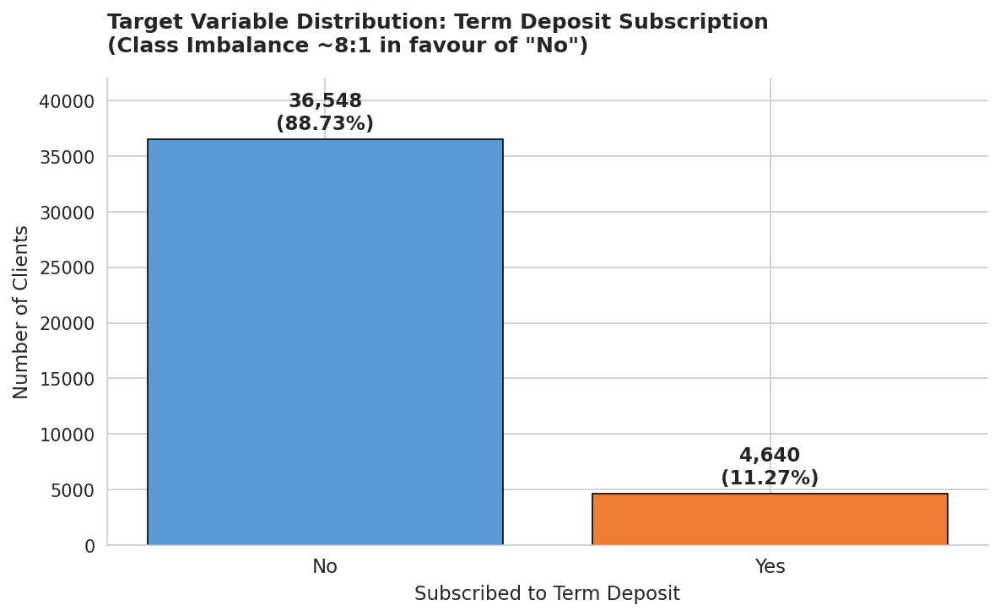
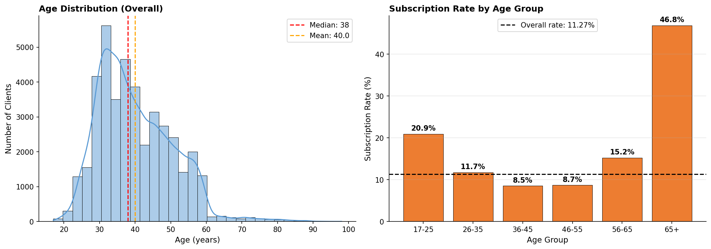
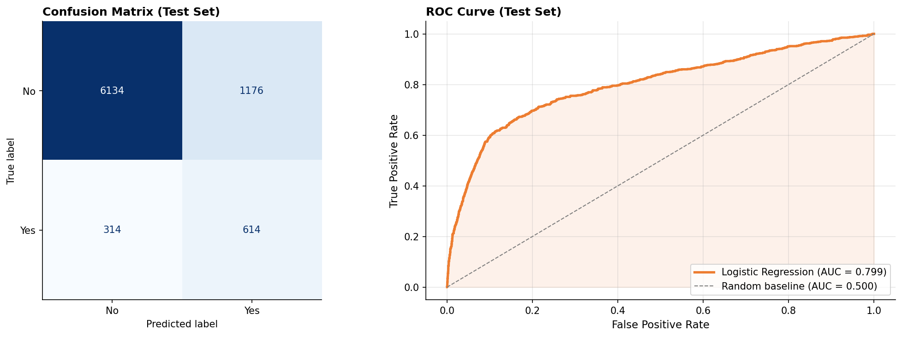
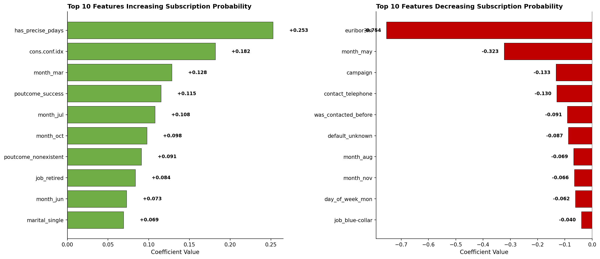

# Bank Marketing Analysis & Term Deposit Prediction

> **End-to-end data science project: from exploratory analysis to predictive modeling on 41,188 bank marketing records, delivering 3× lift over baseline conversion.**

   

---

## 📌 Project Overview

This project analyzes a Portuguese bank's direct marketing campaigns to understand customer behavior and predict whether a client will subscribe to a term deposit. The work is delivered as two end-to-end Jupyter notebooks — exploratory data analysis followed by predictive modeling.

**Key result:** A Logistic Regression classifier that identifies high-conversion prospects with **3.04× lift over random calling** — translating to approximately **600 additional subscribers per 8,000 calls** at zero additional operational cost.

---

## 🎯 Business Problem

A Portuguese bank ran phone-based marketing campaigns to sell term deposits. Their challenge:

- The baseline conversion rate was only **11.27%** — nearly 9 of every 10 calls produced no subscription.
- Generic mass-calling wasted agent capacity.
- The bank needed to identify *which* clients to prioritize for outreach.

This project answers: **"Can we predict, before placing a call, which clients are most likely to subscribe — and by how much can that lift conversion efficiency?"**

---

## 📊 Dataset

- **Source:** [UCI Machine Learning Repository — Bank Marketing](https://archive.ics.uci.edu/ml/datasets/bank+marketing)
- **Size:** 41,188 records × 21 features
- **Period:** 2008–2010 (Portuguese banking institution)
- **Target variable:** `y` — whether the client subscribed to a term deposit (yes / no)
- **Class balance:** 11.27% positive — a heavily imbalanced problem

---

## 📁 Repository Structure

```
bank-marketing-analysis/
│
├── README.md                          ← you are here
├── data/
│   └── data.csv                       ← UCI Bank Marketing dataset
├── notebooks/
│   ├── 01_EDA.ipynb                   ← exploratory data analysis
│   └── 02_Modeling.ipynb              ← predictive modeling pipeline
└── images/                            ← visualizations
    ├── target_distribution.png
    ├── age_analysis.png
    ├── job_analysis.png
    ├── duration_analysis.png
    ├── contact_method_analysis.png
    ├── campaign_frequency_analysis.png
    ├── financial_obligations_analysis.png
    ├── correlation_heatmap.png
    ├── model_evaluation.png
    └── feature_importance.png
```

---

## 🔍 Notebook 1 — Exploratory Data Analysis

A structured investigation of dataset integrity, statistical patterns, and feature-target relationships.

**Highlights:**
- Identified **6 categorical columns** using `"unknown"` as a pseudo-missing placeholder, most severely `default` (20.9% unknowns).
- Discovered an **asymmetric tracking pattern**: the bank retained precise timing for all 1,373 successful prior campaigns but dropped timing for 97% of failed prior campaigns — a finding that drove later feature engineering.
- Found that **macroeconomic indicators** dominate over individual demographics as predictors.
- Flagged severe **multicollinearity** (|r| > 0.97 between `euribor3m` and `emp.var.rate`).
- Identified **data leakage** in the `duration` feature — only knowable post-call.

→ [Open the EDA notebook](./notebooks/01_EDA.ipynb)

---

## 🤖 Notebook 2 — Predictive Modeling

A full machine learning pipeline: feature engineering, encoding, scaling, training, and evaluation.

### Feature Engineering Decisions (driven by EDA findings)

| Decision | Rationale |
|---|---|
| **Dropped** `duration` | Data leakage — only known post-call |
| **Dropped** `emp.var.rate`, `nr.employed`, `cons.price.idx` | Multicollinear with `euribor3m` |
| **Engineered** `has_precise_pdays` | Captures the asymmetric tracking pattern from EDA |
| **Engineered** `was_contacted_before` | Cleaner replacement for raw `pdays = 999` |
| **Retained** `"unknown"` as a category | Validated as informative, not noise |

### Model Performance (Test Set, n = 8,238)

| Metric | Logistic Regression | Naive Baseline |
|---|---|---|
| Accuracy | 81.91% | 88.74% |
| ROC-AUC | **0.7988** | 0.500 |
| Recall (Yes) | **66.2%** | 0.0% |
| Precision (Yes) | **34.3%** | undefined |
| F1-Score (Yes) | 0.452 | 0.0 |

### Business Translation

- **3.04× conversion lift** — model-recommended contacts convert at 34.3% vs. baseline of 11.27%.
- **66.2% of actual subscribers identified** — the naive model catches zero.
- Per 8,000 calls, the model yields ~600 additional subscribers vs. random selection — **same operational cost, 3× the return**.

→ [Open the Modeling notebook](./notebooks/02_Modeling.ipynb)

---

## 📈 Key Visualizations

### Target Distribution — Severe Class Imbalance


### Age vs. Subscription Rate — A Strong U-Shape Pattern


### Model Evaluation — Confusion Matrix & ROC Curve


### Feature Importance — What Drives Predictions


---

## 💡 Top Business Recommendations

1. **Time campaigns against the interest-rate cycle** — `euribor3m` is the single strongest predictor (coefficient = -0.754).
2. **Default to cellular contact** — 14.74% conversion vs. 5.23% for telephone (2.82× difference).
3. **Cap contacts at 4-5 per client per campaign** — conversion drops below 7% after the 5th contact and below 3% beyond 11 contacts.
4. **Reallocate effort from `blue-collar` to `retired` and `student` segments** — 4-5× higher conversion in smaller segments.
5. **Treat `default = unknown` as a low-priority segment, not as missing data** — non-disclosure is itself a -7.7 pp signal vs. clean-credit clients.
6. **Capture mobile numbers at customer onboarding** — channel reachability alone is predictive.

---

## 🛠️ Tech Stack

- **Python 3.10**
- **pandas** — data manipulation
- **NumPy** — numerical operations
- **scikit-learn** — model training, evaluation, scaling
- **Matplotlib / Seaborn** — visualization
- **Jupyter / Google Colab** — notebook environment

---

## ▶️ How to Run

**Option 1 — Run in Google Colab (no installation needed):**

- [Open 01_EDA.ipynb in Colab](https://colab.research.google.com/github/neha-jdb/bank-marketing-analysis/blob/main/notebooks/01_EDA.ipynb)
- [Open 02_Modeling.ipynb in Colab](https://colab.research.google.com/github/neha-jdb/bank-marketing-analysis/blob/main/notebooks/02_Modeling.ipynb)

**Option 2 — Run locally:**

```bash
git clone https://github.com/neha-jdb/bank-marketing-analysis.git
cd bank-marketing-analysis
pip install pandas numpy scikit-learn matplotlib seaborn jupyter
jupyter notebook
```

---

## 🔮 Future Work

- **Tree-based models** (Random Forest, XGBoost) — would naturally capture the non-linear age and campaign patterns the linear model misses; typically reach ROC-AUC 0.80–0.82 on this dataset.
- **Age binning** before linear encoding — would let Logistic Regression access the U-shape signal.
- **Threshold tuning** — calibrate the 0.5 default against the business's cost ratio between false positives and false negatives.
- **SHAP value analysis** — individual-level prediction explanations for any client-facing or regulated deployment.
- **Online deployment design** — real-time scoring API, model monitoring, and integrated contact-frequency cap CRM rules.

---

## 👤 Author

**Neha Kumari**
*Data Analyst | Business Analytics*

- 📧 [nehakumari53085@gmail.com](mailto:nehakumari53085@gmail.com)
- 💼 [LinkedIn](https://www.linkedin.com/in/neha-kumari-a71434220/)
- 🐙 [GitHub](https://github.com/neha-jdb)

---

*This project was completed as part of the **Skillfied Mentor Data Analytics Internship**.*
